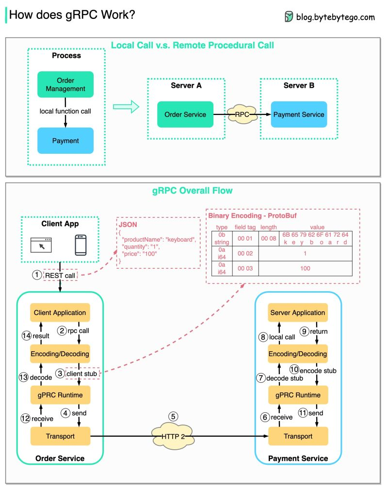

# RPC (Remote Procedure Call)

Gọi là “remote” vì nó cho phép việc giao tiếp giữa các services ở xa nhau, khi các services được deploy trên các server khác nhau dưới kiến trúc microservice. Dưới góc nhìn của người dùng, nó hoạt động như một local function call.

Hình dưới đây mô tả tổng quan luồng hoạt động của gRPC:

Bước 1: Client gọi REST api, request body thường là JSON format

Bước 2-4: Order Service (gRPC client) nhận REST call, chuyển đổi nó và gọi RPC tới Payment Service. gPRC encode client stub thành binary format và gửi nó tới tầng transport

Bước 5: gRPC gửi các package qua network với giao thức HTTP2. Vì được mã hoá thành binary và tối ưu hoá network, gRPC được cho là nhanh gấp 5 lần so với JSON.

Bước 6-8: Payment Service (gRPC server) nhận các package, decode chúng và xử lý ở server application.

Bước 9-11: Kết quả được trả về từ server application và được encode sau đó gửi đến tầng transport

Bước 12-14: Order Service nhận các package, decode chúng và gửi kết quả đến client application

Nguồn: [https://www.linkedin.com/posts/alexxubyte_systemdesign-coding-interviewtips-activity-6995426338186665985-ib1-?utm_source=share&utm_medium=member_desktop](https://www.linkedin.com/posts/alexxubyte_systemdesign-coding-interviewtips-activity-6995426338186665985-ib1-?utm_source=share&utm_medium=member_desktop)