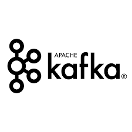

# Sự khác biệt giữa RabbitMQ và Kafka

- [RabbitMQ](#rabbitmq)
  - [RabbitMQ là gì?](#rabbitmq-là-gì)
  - [Khi nào thì sử dụng RabbitMQ?](#khi-nào-thì-sử-dụng-rabbitmq)
- [Kafka](#kafka)
  - [Kafka là gì?](#kafka-là-gì)
  - [Khi nào thì sử dụng Kafka?](#khi-nào-thì-sử-dụng-kafka)
- [Khác biệt giữa RabbitMQ và Kafka](#khác-nhau-giữa-rabbitmq-và-kafka)

## RabbitMQ

### RabbitMQ là gì?

RabbitMQ là một phần mềm message-broker - một thành phần trung gian phục vụ cho việc giao tiếp giữa các service thông qua message. RabbitMQ có thể giải quyết một số bài toán cần high-throughput như các online transaction hay xử lý payment. Nó thường được sử dụng để xử lý các background job, các cronjob hoặc hoạt động dưới dạng một message broker giữa các service.   

### Khi nào thì sử dụng RabbitMQ?

- RabbitMQ hữu ích khi chúng ta không cần tính năng replay các message trong một topic. Nếu muốn gửi lại một tin nhắn, ta phải thông qua Producer.
- RabbitMQ không phụ thuộc vào ngôn ngữ, chúng ta có thể tạo microservice với các ngôn ngữ khác nhau. RabbitMQ cho phép tích hợp nhiều ngôn ngữ hơn Kafka.
- Sử dụng RabbitMQ khi có các tương tác point-to-point phức tạp (các requests và responses) giữa nhiều microservice publish/subscribe.

## Kafka

### Kafka là gì?

Không giống như RabbitMQ, Kafka là là một framework implementation của một [software bus](https://en.wikipedia.org/wiki/Software_bus) sử dụng mô hình pub-sub của stream-processing, hay nói cách khác, nó là một distributed publish-subscribe messaging system.

Kafka là một open-source software platform được phát triển bởi Apache Software Foundation và được viết bằng Scala và Java. Dự án này nhằm mục đích cung cấp một platform thống nhất, high-throughput, low-latency để xử lý giữ liệu real-time. 

### Khi nào thì sử dụng Kafka?

- Khi ta cần tính năng replay các message, consumer có thể trực tiếp replay chúng. Tính năng replay giúp chúng ta không bị mất message nào nếu có lỗi trên consumer hoặc consumer bị quá tải hay chưa ở trạng thái ready. Chúng ta có thể fix issue này bằng cách đưa consumer trở lại trạng thái ready và replay các message (đưa offset về vị trí trước đó).
- Khi ứng dụng có high throughput, lúc này ứng dụng phải xử lý một lượng lớn các message.

> Ví dụ về high-throughput:
> 
> System:
> - Receive 1M requests per second
> - Avg size per request: 1kB
> 
> => Throughput = 1kB x 1M = 1GB/s

## Khác nhau giữa RabbitMQ và Kafka

Cả RabbitMQ và Kafka đều phục vụ chung một mục đích, đều là các event handling system (hệ thống xử lý sự kiện), là open-source và được tin dùng bởi nhiều doanh nghiệp. Tuy nhiên giữa chúng có nhiều sự khác biệt.

### Cơ chế Pull và Push

#### Apache Kafka: Pull-based approach

Kafka sử dụng cách tiếp cận pull-based với một _smart consumer_, nghĩa là consumer phải request một lượng message từ một offset cụ thể. Kafka cho phép long-pooling (khả năng thiết lập khoảng thời gian một Kafka producer gửi tới một loạt các event), cho phép các consumer khác nhau consume các event với tốc độ khác nhau. Kafka đảm bảo thứ tự của các message trong cùng một partition, long-pooling cũng cho phép người dùng tận dụng việc gộp các message để gửi message hiệu quả và có throughput cao hơn. 

#### RabbitMQ: Push-based approach

RabbitMQ sử dụng mô hình push-based với smart producer, nghĩa là producer quyết định khi nào thì push data. Một prefetch limit được xác định trước trên các consumer để ngăn producer gây quá tải các consumer. Cách tiếp cận push-based như vậy phù hợp với low latency messaging (gửi message với độ trễ thấp).

Mô hình push nhằm mục đích phân chia khối lượng công việc đồng đều giữa các consumer khác nhau bằng cách phân phối các message một cách độc lập và nhanh chóng. Do đó các message được xử lý gần như đúng theo thứ tự mà chúng được đưa vào queue. Thứ tự xử lý là xấp xỉ và không chắc chắn vì một số message có thể được xử lý nhanh hơn các message khác.

## Tham khảo

- [RabbitMQ Vs Kafka: What’s The Difference?](https://www.interviewbit.com/blog/rabbitmq-vs-kafka/)
- [RabbitMQ và Kafka Phần 1 - Hai hệ thống truyền tin khác nhau](https://dodangquan.blogspot.com/2018/10/rabbitmq-va-kafka-phan-1-hai-he-thong-truyen-tin-khac-nhau.html)